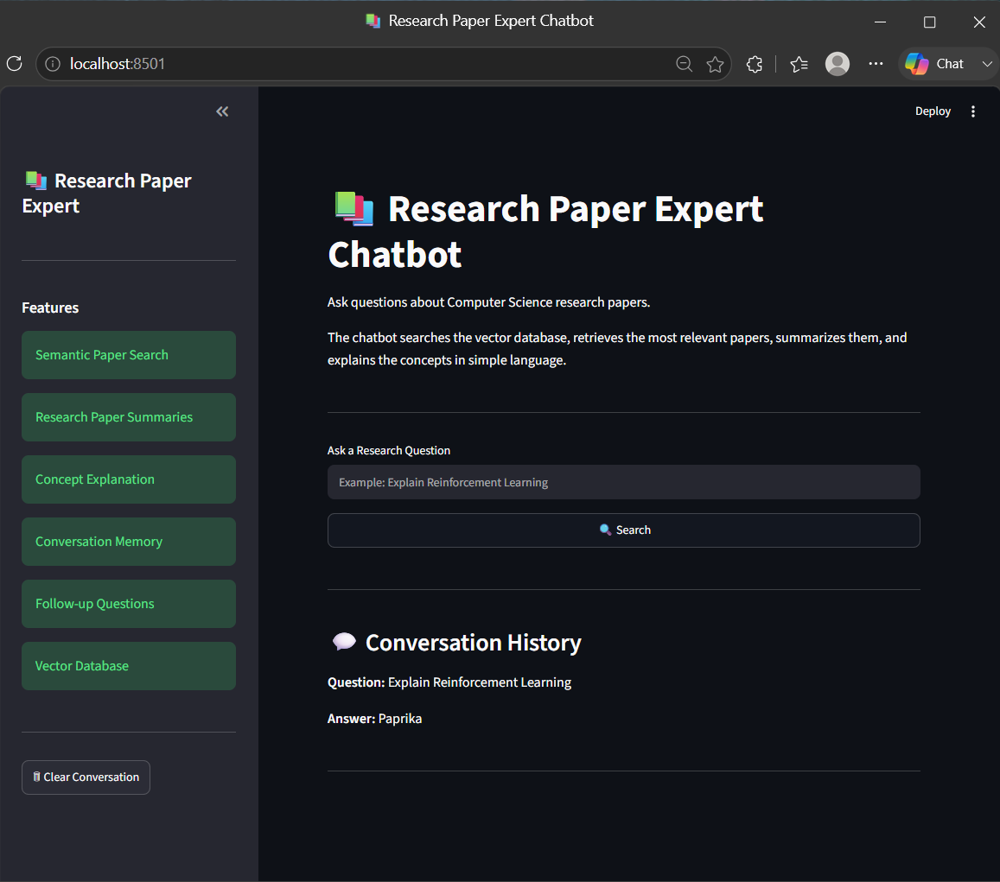
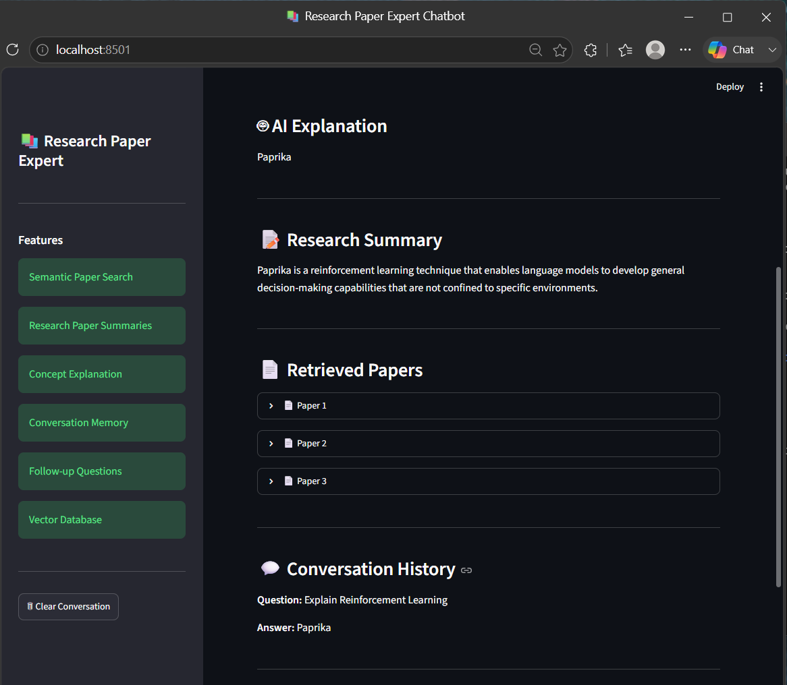
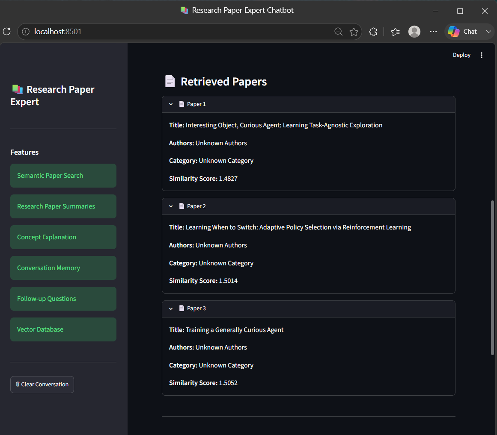

# 📚 Research Paper Expert Chatbot using RAG, LangChain & Open-Source LLM


## 📖 Project Overview

The **Research Paper Expert Chatbot** is an AI-powered domain-specific chatbot developed as part of the **ElevanceSkills Data Science Internship – Task 4**. The chatbot specializes in answering advanced questions related to **Computer Science research papers** by leveraging **Retrieval-Augmented Generation (RAG)**.

Instead of generating responses purely from a language model, the chatbot retrieves relevant research papers from the **arXiv Computer Science Dataset**, summarizes the retrieved content, and provides clear, easy-to-understand explanations for users.

The application is built using **Python**, **LangChain**, **ChromaDB**, **Hugging Face Transformers**, and **Streamlit**, creating an intelligent research assistant capable of semantic search, concept explanation, and follow-up conversations.

---

# 🎯 Internship Task

**Task 4 – Domain Expert Chatbot**

### Objective

Develop a chatbot that serves as an expert in a specific domain, capable of answering complex queries and explaining concepts.

Dataset Used:

- arXiv Computer Science Dataset
- Source: https://www.kaggle.com/datasets/Cornell-University/arxiv

Expected Features:

- Domain-specific question answering
- Research paper search
- Semantic retrieval
- Research paper summarization
- Concept explanation
- Follow-up conversation support
- Streamlit-based interactive interface

---

# 🚀 Features

✅ Semantic Search over Computer Science Research Papers

✅ Retrieval-Augmented Generation (RAG)

✅ Chroma Vector Database

✅ Hugging Face Embeddings

✅ AI-powered Research Paper Summarization

✅ Concept Explanation in Simple Language

✅ Follow-up Question Support

✅ Conversation Memory

✅ Similar Research Paper Retrieval

✅ Interactive Streamlit Dashboard

---

# 🏗️ System Architecture

```
                     User Question
                           │
                           ▼
                Streamlit User Interface
                           │
                           ▼
                Semantic Vector Search
                           │
                           ▼
                  Chroma Vector Database
                           │
                           ▼
          Retrieve Top Relevant Research Papers
                           │
                           ▼
             Research Paper Summarization
                           │
                           ▼
             AI Explanation Generation
                           │
                           ▼
                  Final Response to User
```

---

# 📂 Project Structure

```
Research_Paper_Expert_Chatbot/

│
├── app4.py
├── requirements.txt
├── README.md
├── create_vectordb.py
│
├── src/
│   ├── chatbot.py
│   ├── loader.py
│   ├── chunker.py
│   ├── retriever.py
│   ├── summarizer.py
│   ├── explainer.py
│   ├── memory.py
│   └── vectorstore.py
│
├── data/
│   ├── create_arxiv_cs.py
│   ├── reduce_dataset.py
│   └── dataset files
│
└── assets/
```

---

# 🧠 Technologies Used

- Python
- Streamlit
- LangChain
- ChromaDB
- Hugging Face Transformers
- Sentence Transformers
- FLAN-T5
- Pandas
- NumPy
- arXiv Dataset

---

# 📊 Dataset

The chatbot is trained using the **arXiv Computer Science Metadata Dataset**.

Dataset Source:

https://www.kaggle.com/datasets/Cornell-University/arxiv

> **Note:** The original dataset is over **1 GB** and cannot be uploaded to GitHub due to GitHub's file size limitations. Please download it from Kaggle before running the project.

---

# ⚙️ Installation

Clone the repository

```bash
git clone https://github.com/YOUR_USERNAME/Research-Paper-Expert-Chatbot.git

cd Research-Paper-Expert-Chatbot
```

Install dependencies

```bash
pip install -r requirements.txt
```

Generate the vector database

```bash
python create_vectordb.py
```

Run the application

```bash
streamlit run app4.py
```

---

# 💬 Example Questions

- Explain Reinforcement Learning.
- What is Transfer Learning?
- Explain Graph Neural Networks.
- Summarize the Transformer Architecture.
- What is Deep Reinforcement Learning?
- Explain Diffusion Models.

---

# 📸 Application Screenshots

## Home Page



---

## Search Results



---

## Research Paper Retrieval



---

# 📈 Expected Outcome

The chatbot successfully:

- Retrieves relevant Computer Science research papers.
- Performs semantic search using vector embeddings.
- Summarizes technical research papers.
- Explains advanced concepts in simple language.
- Maintains conversational context for follow-up questions.
- Provides an interactive research assistant through Streamlit.

---

# 🔮 Future Enhancements

- PDF Research Paper Upload
- Citation Generation
- Research Paper Comparison
- Research Trend Analysis
- Multi-domain Knowledge Base
- Interactive Concept Visualization
- Voice-based Question Answering
- LLM Fine-tuning on Research Papers

---

# 👨‍💻 Author

**Manda Sankeerth**

B.Tech – Electronics & Communication Engineering

Mallareddy Engineering College

Data Science Intern – ElevanceSkills

GitHub:
https://github.com/SANKEERTH2006-TECH

---

# 🙏 Acknowledgements

- ElevanceSkills
- Hugging Face
- LangChain
- ChromaDB
- arXiv
- Streamlit
- Kaggle

---

# ⭐ If you found this project useful, please consider giving it a Star on GitHub!
